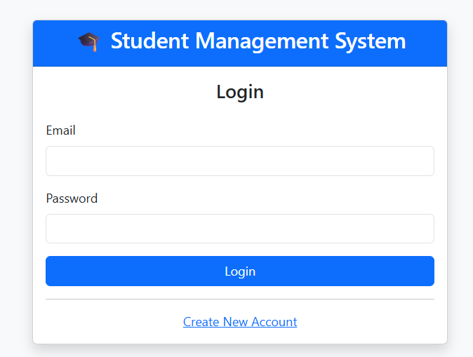
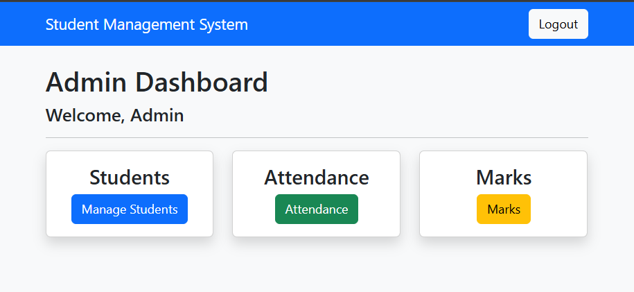
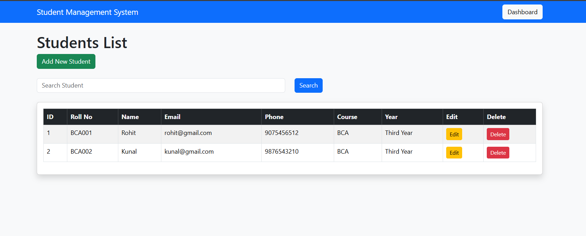
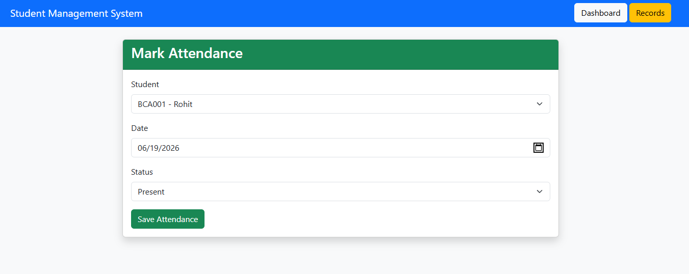
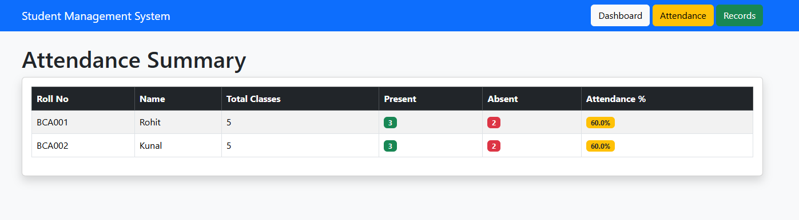
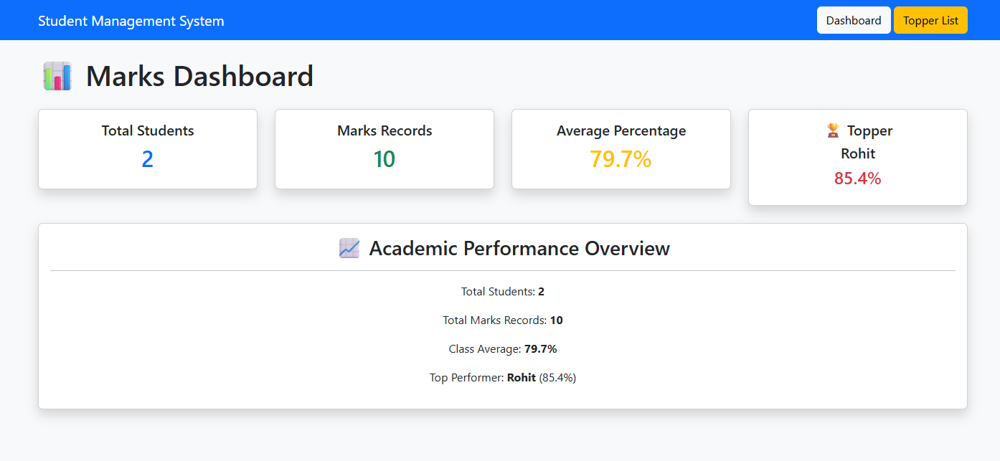
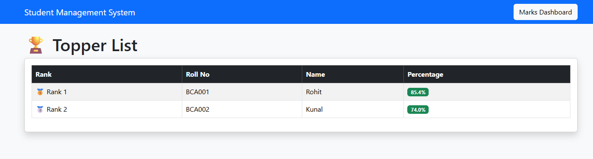
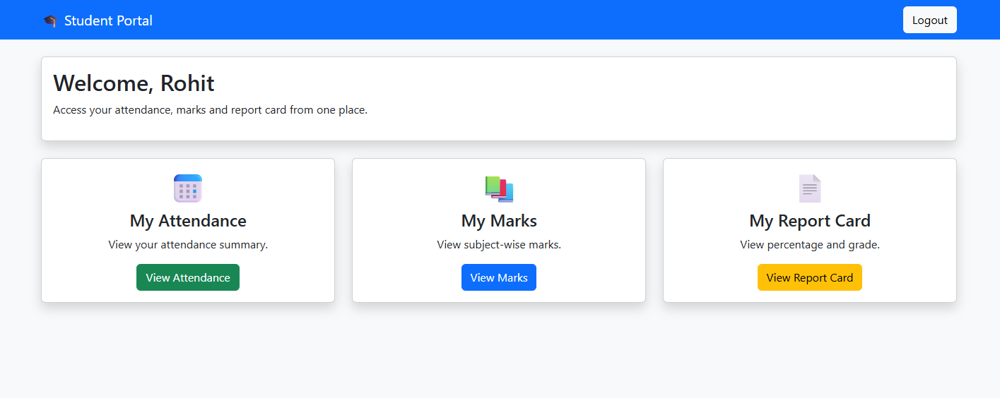
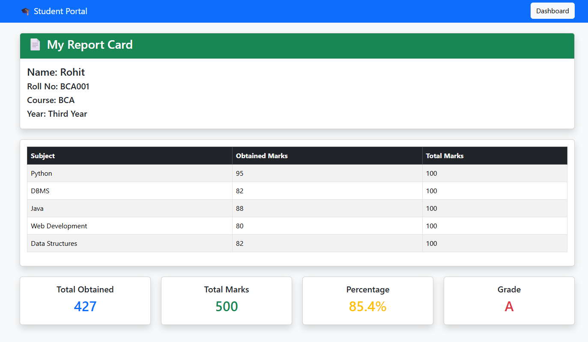

# 🎓 Student Management System

A role-based Student Management System developed using Flask, MySQL, SQLAlchemy, Flask-Login, and Bootstrap 5.

The system provides separate dashboards and permissions for Admin, Teacher, and Student users, allowing efficient management of students, attendance, marks, and report cards.

---

## 🚀 Features

### 🔐 Authentication & Authorization

* User Registration
* User Login
* User Logout
* Password Hashing
* Role-Based Access Control

### 👨‍💼 Admin Features

* Manage Students
* View Attendance Records
* View Attendance Summary
* Manage Marks
* View Topper List
* Access Reports

### 👨‍🏫 Teacher Features

* Mark Attendance
* View Attendance Records
* Add Student Marks
* Edit Marks
* View Topper List

### 👨‍🎓 Student Features

* View My Attendance
* View My Marks
* View My Report Card

### 📊 Attendance Management

* Mark Present/Absent
* Attendance Records
* Attendance Summary
* Attendance Percentage Calculation

### 📝 Marks Management

* Add Marks
* Edit Marks
* Delete Marks
* Search Marks
* Marks Dashboard
* Topper List

### 📄 Report Card System

* Subject-wise Marks
* Total Marks Calculation
* Percentage Calculation
* Grade Calculation

---

## 🛠 Technologies Used

* Python
* Flask
* MySQL
* SQLAlchemy
* Flask-Login
* Bootstrap 5
* HTML5
* CSS3

---

## 📸 Project Screenshots

### Login Page



### Admin Dashboard



### Student Management



### Attendance Management



### Attendance Summary



### Marks Dashboard



### Topper List



### Student Dashboard



### My Report Card



---

## ⚙️ Installation

Clone the repository:

```bash
git clone https://github.com/Rohit-Ibrampure-coder/Student-Management-System.git
```

Navigate to project folder:

```bash
cd Student-Management-System
```

Install dependencies:

```bash
pip install -r requirements.txt
```

Run the application:

```bash
python app.py
```

Open browser:

```text
http://127.0.0.1:5000
```

---

## 📌 Future Enhancements (Version 1.1)

* Semester Management
* Subject Management
* PDF Report Card Export
* Student Photo Upload
* Dashboard Analytics
* ERP-Style Academic Structure
* Excel Export

---

## 👨‍💻 Author

**Rohit Ibrampure**

BCA Student | Python & Flask Developer

Student Management System Version 1.0
